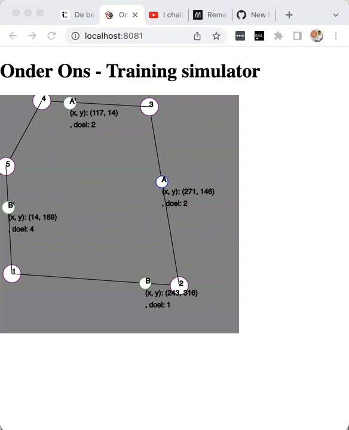

# Onder Ons Training simulator

Visualiseren van loopoefening in duo's in tegengestelde richting, zoals bij Onder ons middaggroep.

Het keren moet nog ingebouwd, wel ondersteund simulator al willekeurig aantal spelers, hoekpunten en lopen in 2 richtingen.

Later wellicht meer instelbaar en andere oefeningen ook mogeijk make te simuleren.

